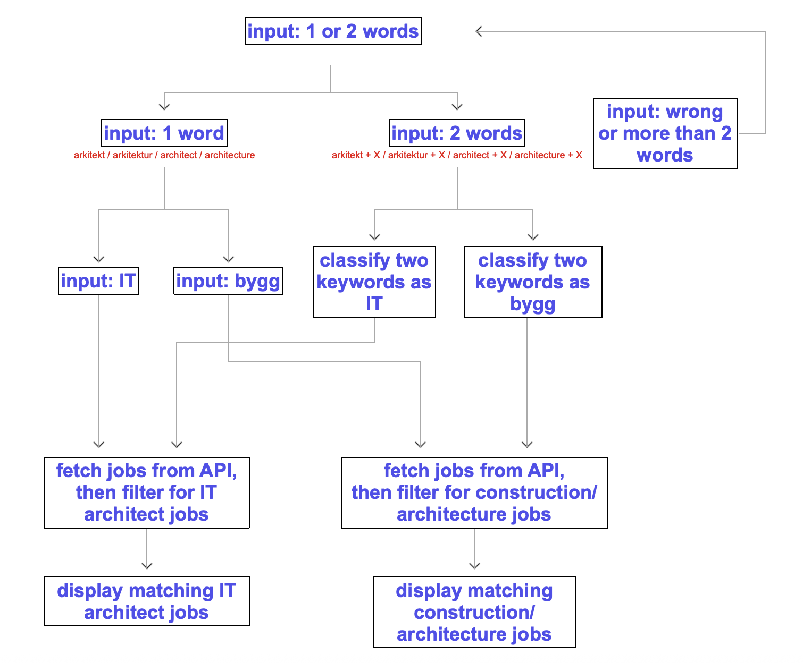

# Prototype Job Search for Architecture Roles

## Goal

This project is a prototype for searching architecture-related jobs through the JobTech API. It distinguishes between:

- IT architecture (`IT`)
- construction and building architecture (`bygg/arkitektur`)

The user enters one or two keywords. When the input is an ambiguous term such as `architect` or `arkitekt`, the program asks whether the user means IT or construction. It then retrieves job advertisements, applies local keyword filtering, and prints the matching results.

The project is intentionally limited. It demonstrates basic Python, API use, data handling, functions, loops, conditions, classes, inheritance, and error handling without attempting to create a complete job-search system.



The diagram shows the intended stages of the search. It is a conceptual overview and does not represent every implementation detail.

## Method

1. Read one or two keywords from the user.
2. Normalize the input by removing extra spaces, converting it to lowercase, and splitting it into a list.
3. Classify the search as IT, construction/architecture, or unknown.
4. Ask a follow-up question for an ambiguous architect-related search.
5. Request a limited number of advertisements from the JobTech API.
6. Clean the raw API records into simpler dictionaries.
7. Filter the jobs by search words and selected field.
8. Print the matching headline, employer, city, and category.

The API endpoint is:

```text
https://jobsearch.api.jobtechdev.se/search
```

The classifier checks complete words in the job text. This prevents `it` from being found inside `revit`, while still allowing `IT` to be recognized as its own keyword.

## Project Structure

```text
Projektarebete/
├── main.ipynb
├── keywords.py
├── images/
│   └── workflow.png
└── README.md
```

- `main.ipynb`: the combined notebook used for the step-by-step submission. It contains the imports, classes, classifier, API handling, output functions, and main workflow in separate cells.
- `keywords.py`: contains the IT, architecture, and role keyword sets.

## OOP And Error Handling

The project contains a parent class and child classes:

```python
Job
├── ITJob
└── ArchitectureJob
```

The child classes inherit from `Job` and provide their own category through `get_category()`.

`try/except` is used around the API request to handle network errors, HTTP errors, invalid JSON, and unexpected API data. Input length is checked with ordinary `if` statements. This keeps error handling in places where errors are reasonably expected.

## Result And Risks

The program can fetch jobs and display a smaller number after local filtering. For example, the API may return 9 jobs while only 3 pass the local conditions.

The API data is external and may be broad or inconsistently categorized. Employers or the source system may place jobs such as `Agile Architect` or `Solution Architect` in categories that do not match the user’s intended field. The website’s category filters and the API’s returned data are therefore not fully under the program’s control.

The local classifier is also based on simple keyword matching. It cannot understand the complete meaning of an advertisement, synonyms, or context. The result should therefore be understood as a keyword-based prototype search, not a guarantee that every displayed job is perfectly relevant.

## Current Limitations

- The program accepts only one or two search words.
- The API may return jobs that are only partly relevant.
- Local filtering can remove jobs that might be relevant.
- The same search can return different results as the API data changes.
- The program currently does not rank results by relevance.
- The current code retrieves and processes data but does not yet save a CSV or JSON data file.

## Running The Project

1. Open the project folder in VS Code.
2. Open `main.ipynb`.
3. Select a Python environment with `requests` installed.
4. Run the notebook cells in order.
5. Run the final cell to start the program.
6. Enter one or two keywords when prompted.
7. For `architect` or `arkitekt`, answer whether the intended field is IT or construction.

An internet connection is required because the program uses the JobTech API.

## Assignment Checklist

Already demonstrated by the current code:

- Python variables, lists, dictionaries, conditions, loops, and functions
- parent and child classes with inheritance
- standard Python features and the external `requests` library
- public API data
- relevant `try/except` handling for API errors
- Jupyter Notebook code

Still required or to be checked before submission:

- Save and include the retrieved or processed data as CSV or JSON.
- Add an analysis of AI-industry roles and trends.
- Add relevant professional certificates, such as AWS, Azure, or Databricks.
- Add a reflection on technical choices, results, difficulties, and improvements.
- Add the final GitHub repository link.
- Confirm at least five GitHub commits with clear messages.
- Confirm whether the final delivery should use one notebook with multiple cells.

## Reflection

The prototype shows that an external job API can be combined with keyword classification and object-oriented Python. The main difficulty is data quality: the API and employers do not always classify architecture jobs consistently. A future version could save the data, use more occupation fields, improve relevance filtering, and support more keywords, but the current version deliberately keeps the logic understandable.

## GitHub

Repository link: **to be added before submission**
